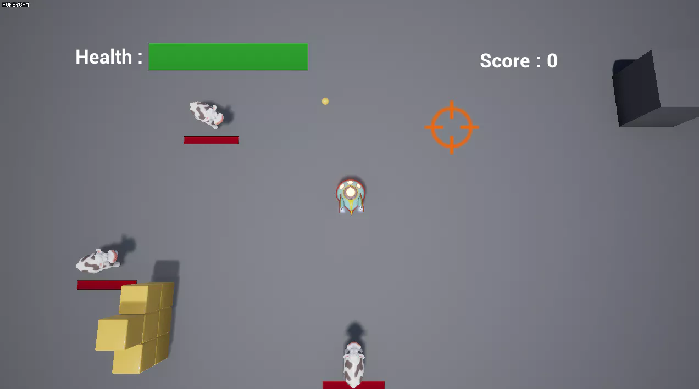

# 포트폴리오 : 탑뷰 슈팅게임
## 소개

우유를 던지는 젖소를 쏴죽이는 게임입니다.

총 5마리의 젖소가 나오며 1마리를 죽이면 100점의 점수가 오릅니다. 
플레이어나 적 중 한쪽이 전멸하면 결과창이 뜨며 여기서 재시도하거나 게임을 종료 가능합니다.

## 구현내용
 - 플레이어 생성 및 이동
 - 적 생성 및 이동
 - 적 AI 처리 : 비헤이비어 트리
 - 발사체 발사 및 충돌처리
 - UI 처리
    - 메뉴화면
    - 플레이어 및 AI 체력바
    - 플레이어 점수 표시
    - 결과창 : 재시도, 게임종료

## 키입력
Key | 액션
--- | ----
W   | 상단 이동
A   | 좌측 이동
S   | 하단 이동
D   | 우측 이동
Mouse Move | 플레이어폰 회전
Mouse L Click | 프로젝타일 발사